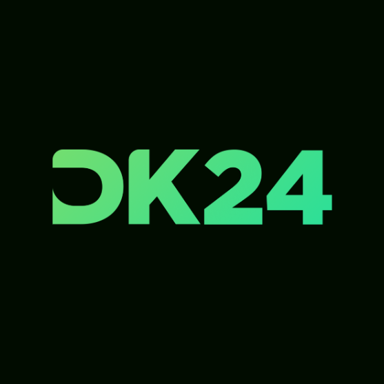

# DK24 Community Website

<div align="center">
  

  <h3>🌐 Connecting College Tech Communities</h3>
  <p><em>We are connecting college tech communities to learn and build together in public.</em></p>

  [](https://nextjs.org/)
  [](https://www.typescriptlang.org/)
  [](https://tailwindcss.com/)
  [](https://ui.shadcn.com/)
  [](https://opensource.org/licenses/MIT)

  [🌐 Live Demo](https://dk24.netlify.app) • [📚 Documentation](#documentation) • [🤝 Contributing](#contributing) • [💬 Community](#community)
</div>

## 📖 Table of Contents

- [About DK24](#-about-dk24)
- [Features](#-features)
- [Tech Stack](#️-tech-stack)
- [Quick Start](#-quick-start)
- [Project Structure](#-project-structure)
- [TEAM Model](#-team-model)
- [Development](#️-development)
- [Contributing](#-contributing)
- [Community](#-community)
- [License](#-license)

## 🌟 About DK24

DK24 is a revolutionary community initiative that bridges the gap between college tech communities across Mangalore, Karnataka. We're not here to replace existing college communities – we're the **bridge** that connects them all.

### 🎯 Our Mission
> *"The core and ultimate purpose of DK24 is to foster the learning and building environment among our peers and juniors, where we aim toward project-based learning, which will give rise to the next generation of engineers and tech entrepreneurs."*

### 🔮 Our Vision
> *"Our goal is to have a tech ecosystem in Mangalore in the next 10 years, where we will be having a diverse network, that any student who has an idea or the spark to do something, will have the best resource he/she can access in the city."*

### 🤔 Why DK24?
As independent college communities, we are just small pockets of resources spread over various places. We can utilize maximum power when there is sharing of resources and knowledge between these pockets, and **DK24 is the bridge connecting all of them together**.

## ✨ Features

### 🏠 **Homepage Experience**
- **Hero Section**: Compelling introduction with clear call-to-action
- **Vision Showcase**: Interactive cards explaining our core values
- **TEAM Model**: Visual representation of our community structure
- **Featured Projects**: Carousel of ongoing collaborative projects
- **Upcoming Events**: Preview of community events
- **Testimonials**: Real stories from community members

### 👥 **Community Structure**
- **Interactive TEAM Model**: Visual breakdown of roles and responsibilities
- **Progression Pathways**: Clear advancement criteria
- **Role Descriptions**: Detailed explanation of each community role
- **Mentorship Network**: Connection between different levels

### 🏫 **Member Colleges**
- **College Profiles**: Detailed information about each member institution
- **Community Showcases**: Highlighting unique aspects of each college community
- **Representative Directory**: Contact information for community leaders
- **Achievement Highlights**: Success stories from each college

### 📅 **Events Management**
- **Event Calendar**: Interactive calendar with upcoming events
- **Registration System**: Seamless event registration process
- **Past Events Archive**: Documentation of previous events with outcomes
- **Multi-format Support**: Virtual, hybrid, and in-person events

### 🚀 **Project Showcase**
- **Live Projects**: Real-time updates on ongoing collaborative projects
- **Project Contributors**: Recognition for all team members
- **Technology Stack**: Detailed tech information for each project
- **Impact Metrics**: Quantifiable results and community impact

### 🤝 **Join Platform**
- **Dual Registration**: Separate flows for individuals and colleges
- **Smart Forms**: Intelligent form validation and user guidance
- **Application Tracking**: Status updates for applicants
- **Onboarding Process**: Structured introduction for new members

## 🛠️ Tech Stack

### **Frontend Framework**
- **[Next.js 15](https://nextjs.org/)** - React framework with App Router
- **[TypeScript](https://www.typescriptlang.org/)** - Type-safe JavaScript
- **[React 19](https://reactjs.org/)** - UI library with latest features

### **Styling & UI**
- **[Tailwind CSS 4](https://tailwindcss.com/)** - Utility-first CSS framework
- **[shadcn/ui](https://ui.shadcn.com/)** - High-quality React components
- **[Framer Motion](https://www.framer.com/motion/)** - Production-ready motion library
- **[Lucide React](https://lucide.dev/)** - Beautiful & consistent icons

### **Form & Validation**
- **[React Hook Form](https://react-hook-form.com/)** - Performant forms with easy validation
- **[Zod](https://zod.dev/)** - TypeScript-first schema validation
- **[@hookform/resolvers](https://github.com/react-hook-form/resolvers)** - Validation resolvers

### **Development Tools**
- **[BiomeJs](https://biomejs.dev/)** - Code linting and formatting
- **[next-themes](https://github.com/pacocoursey/next-themes)** - Theme management
- **[class-variance-authority](https://cva.style/)** - Component variant management

## 🚀 Quick Start

### Prerequisites
- **Node.js** 18.0 or later
- **npm**, **yarn**, or **pnpm**
- **Git** for version control

### Installation

1. **Clone the repository**
   ```bash
   git clone https://github.com/Developer-Kommunity-24/community-website.git
   cd community-website
   ```

2. **Install dependencies**
   ```bash
   npm install
   # or
   yarn install
   # or
   pnpm install
   ```

3. **Run the development server**
   ```bash
   npm run dev
   # or
   yarn dev
   # or
   pnpm dev
   ```

4. **Open your browser**
   Navigate to [http://localhost:3000](http://localhost:3000)

### Environment Setup

Create a \`.env.local\` file in the root directory:

```env
# Add your environment variables here
NEXT_PUBLIC_SITE_URL=http://localhost:3000
```

## 🎭 TEAM Model

DK24 operates on a unique **TEAM** structure that ensures sustainable growth and knowledge transfer:

### 🔧 **T - Techie** (1st & 2nd Year)
- **Role**: Foundation builders and eager learners
- **Responsibilities**:
  - Learn fundamental technologies and concepts
  - Contribute to community projects under guidance
  - Participate in hackathons and coding challenges
  - Prove themselves through active participation
- **Selection**: Open to all with supervision and triage

### 🧭 **E - Explorer** (2nd & 3rd Year)
- **Role**: Project leaders and knowledge sharers
- **Responsibilities**:
  - Make meaningful contributions to tech and OSS
  - Lead small to medium-sized projects
  - Supervise techies under triage
  - Conduct workshops and knowledge-sharing sessions
- **Selection**: 4 per institution, chosen by Advisors and Mentors

### 👥 **A - Advisor** (4th Year)
- **Role**: Strategic guides and administrators
- **Responsibilities**:
  - Maintain constant flow of explorers and techies
  - Set promotion metrics with Mentors and Explorers
  - Supervise the explorers
  - Handle administrative work and company connections
- **Selection**: 2 per institution (usually community leaders)

### 🎓 **M - Mentor** (Alumni)
- **Role**: Industry professionals and wisdom keepers
- **Responsibilities**:
  - Provide mentorship to current TEAM members
  - Offer support through knowledge, funds, or connections
  - Make meaningful contributions to tech and OSS
  - Be accessible across the entire network
- **Growth**: Number increases as years pass

## 🛠️ Development

### Available Scripts

```bash
# Development
npm run dev          # Start development server
npm run build        # Build for production
npm run start        # Start production server
npm run format       # Run Biome format check
npm run format:write # Write Biome formatted files
npm run lint         # Run Biome lint
npm run lint:fix     # Fix Biome lint issues
npm run type-check   # Run TypeScript checks
```

### Code Quality Standards

- **TypeScript**: Strict mode enabled for better type safety
- **Biome JS**: Unified linter & formatter(Substitute of ESLint + Prettier)
- **Husky + lint-staged**: Pre-commit hooks for code quality

### Component Development Guidelines

1. **TypeScript First**: Always use TypeScript interfaces for props
2. **Accessibility**: Implement ARIA labels and semantic HTML
3. **Responsive Design**: Mobile-first approach with progressive enhancement
4. **Performance**: Optimize images and implement proper loading states
5. **Testing**: Write tests for complex components and utilities

### Styling Guidelines

- Use Tailwind CSS utility classes
- Follow the design system color palette
- Implement consistent spacing and typography
- Ensure dark mode compatibility
- Maintain responsive breakpoints

## 🤝 Contributing

We welcome contributions from everyone! Whether you're a student, professional, or just passionate about community building, there's a place for you here.

### 🌟 Ways to Contribute

- 🐛 **Bug Reports**: Help us identify and fix issues
- ✨ **Feature Requests**: Suggest new features and improvements
- 📝 **Documentation**: Improve our docs and guides
- 🎨 **Design**: Enhance UI/UX and visual elements
- 💻 **Code**: Contribute to the codebase
- 🌐 **Translation**: Help make DK24 accessible to more people

### 🚀 Getting Started

1. **Fork the repository** on GitHub
2. **Clone your fork** locally
3. **Create a feature branch** (\`git checkout -b feature/amazing-feature\`)
4. **Make your changes** following our guidelines
5. **Test your changes** thoroughly
6. **Commit your changes** (\`git commit -m 'Add amazing feature'\`)
7. **Push to your branch** (\`git push origin feature/amazing-feature\`)
8. **Open a Pull Request** with a clear description

### 📋 Contribution Checklist

- [ ] Code follows the project's style guidelines
- [ ] Self-review of the code has been performed
- [ ] Code is commented, particularly in hard-to-understand areas
- [ ] Corresponding changes to documentation have been made
- [ ] Changes generate no new warnings
- [ ] Tests have been added that prove the fix is effective or feature works
- [ ] New and existing unit tests pass locally

For detailed guidelines, see our [Contributing Guide](.github/CONTRIBUTING.md).

## 💬 Community

### 🌐 Connect With Us

- **🌍 Website**: [dk24.netlify.app](https://dk24.netlify.app)
- **📱 Twitter**: [@dk24community](https://twitter.com/dk24community)
- **💼 LinkedIn**: [DK24 Community](https://linkedin.com/company/dk24community)
- **📷 Instagram**: [@dk24community](https://instagram.com/dk24community)
- **💻 GitHub**: [github.com/dk24](https://github.com/Developer-Kommunity-24)

### 📧 Contact Information

- **General Inquiries**: deveeshshetty@gmail

### 🏫 Member Colleges

- **SOSC** - Sahyadri College of Engineering & Management
- **DevNation** - AJ Institute of Engineering and Technology
- **FiniteLoop** - Nitte Engineering (NMAIT)
- **Sceptix** - St. Joseph College of Engineering and Technology
- **SSOSC** - Srinivas Institute of Engineering and Technology
- **CoRE** - Vivekananda College of Engineering and Technology

## 📊 Project Stats

- **🏫 Member Colleges**: 6 active communities
- **👥 Active Members**: 500+ students and professionals
- **🚀 Projects**: 10+ collaborative projects
- **📅 Events**: 20+ events organized
- **🌟 GitHub Stars**: Help us reach our goal!

## 🗺️ Roadmap

### 🎯 Short Term (Next 3 months)
- [ ] Mobile app development
- [ ] Enhanced project collaboration tools
- [ ] Mentorship matching system
- [ ] Event management platform

### 🚀 Medium Term (6 months)
- [ ] Industry partnership program
- [ ] Skill assessment and certification
- [ ] Alumni network expansion
- [ ] Regional expansion beyond Mangalore

### 🌟 Long Term (1+ years)
- [ ] National community network
- [ ] Startup incubation program
- [ ] Annual tech conference
- [ ] Scholarship and funding programs

## 🙏 Acknowledgments

### 🌟 Core Team
Special thanks to all the community leaders, mentors, and contributors who make DK24 possible.

### 🏫 Founding Colleges
Gratitude to the founding college communities who believed in the vision and helped establish DK24.

### 🛠️ Technology Partners
Thanks to the open-source community and the amazing tools that power our platform:
- Next.js team for the incredible framework
- Vercel for hosting and deployment
- shadcn for the beautiful UI components
- All the open-source contributors whose work we build upon

## 📄 License

This project is licensed under the **MIT License** - see the [LICENSE](LICENSE) file for details.

### What this means:
- ✅ Commercial use
- ✅ Modification
- ✅ Distribution
- ✅ Private use
- ❌ Liability
- ❌ Warranty

## 🔒 Security

If you discover a security vulnerability, please send an e-mail to deveeshshetty@gmail. All security vulnerabilities will be promptly addressed.

## 📈 Analytics and Monitoring

We use privacy-focused analytics to understand how our community uses the platform. No personal data is collected without consent.

<div align="center">
  <h3>🚀 Ready to join the revolution?</h3>
  <p>
    <a href="https://dk24.netlify.app/join">
      
    </a>
  </p>

  <hr>

  <p>Made with ❤️ by the DK24 Community</p>
  <p><em>"Connecting college tech communities to learn and build together in public"</em></p>

  <p>
    <a href="#-table-of-contents">
      
    </a>
  </p>
</div>
