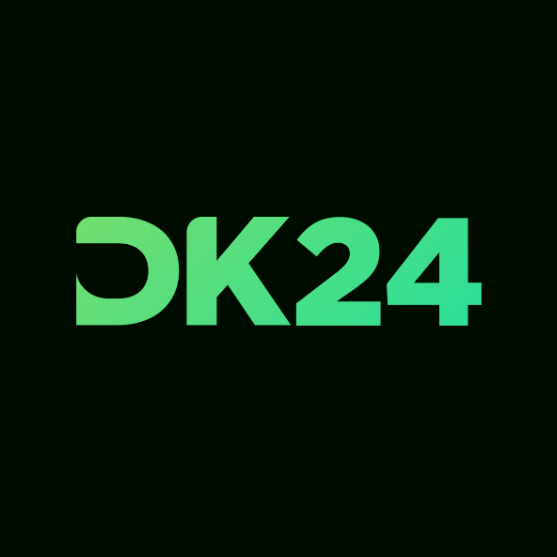

# DK24 Community Website

<div align="center">
  

  <h3>🌐 Connecting College Tech Communities</h3>
  <p><em>We are connecting college tech communities to learn and build together in public.</em></p>

[](https://nextjs.org/)
[](https://www.typescriptlang.org/)
[](https://tailwindcss.com/)
[](https://ui.shadcn.com/)
[](https://opensource.org/licenses/MIT)

[🌐 Live Demo](https://dk24.org) • [🤝 Contributing](#-contributing) • [💬 Community](#-community)

</div>

## 📖 Table of Contents

- [About DK24](#-about-dk24)
- [Quick Start](#-quick-start)
- [Tech Stack](#️-tech-stack)
- [Development](#-development)
- [Contributing](#-contributing)
- [Community](#-community)
- [License](#-license)

## 🌟 About DK24

DK24 is a revolutionary community initiative that bridges the gap between college tech communities across Mangalore, Karnataka. We're not here to replace existing college communities – we're the **bridge** that connects them all.

### 🎯 Our Mission

> _"The core and ultimate purpose of DK24 is to foster the learning and building environment among our peers and juniors, where we aim toward project-based learning, which will give rise to the next generation of engineers and tech entrepreneurs."_

### 🔮 Our Vision

> _"Our goal is to have a tech ecosystem in Mangalore in the next 10 years, where we will be having a diverse network, that any student who has an idea or the spark to do something, will have the best resource he/she can access in the city."_

### 🤔 Why DK24?

As independent college communities, we are just small pockets of resources spread over various places. We can utilize maximum power when there is sharing of resources and knowledge between these pockets, and **DK24 is the bridge connecting all of them together**.

### 🎭 TEAM Model

DK24 operates on a unique **TEAM** structure that ensures sustainable growth and knowledge transfer. To know more, visit: [https://dk24.org/communities](https://dk24.org/communities)

## 🚀 Quick Start

### Prerequisites

- **Node.js** 22 or 24 (LTS versions — avoid 23)
- **pnpm** 10.x — install via `npm install -g pnpm@10.30.3` or see the [pnpm installation guide](https://pnpm.io/installation)
- **Git** for version control

### Installation

```bash
git clone https://github.com/Developer-Kommunity-24/community-website.git
cd community-website
pnpm install
```

### Environment Setup

Create a `.env.local` file in the root directory:

```env
# Add your environment variables here
NEXT_PUBLIC_SITE_URL=http://localhost:3000
```

### Run the Dev Server

```bash
pnpm dev
```

Visit [http://localhost:3000](http://localhost:3000) to see the project.

## 🛠️ Development

### Available Scripts

```bash
pnpm dev          # Start development server
pnpm build        # Build for production
pnpm start        # Start production server
pnpm lint         # Run Biome lint
pnpm lint:fix     # Fix lint issues
pnpm format       # Check code format
pnpm format:write # Auto-format files
pnpm type-check   # Run TypeScript type checks
EVENTS_SOURCE=calendar pnpm dev # Use fake calendar events
```

## 🧰 Tech Stack

### **Frontend Framework**

- **Next.js 15** – App Router with SSR support
- **TypeScript** – Strongly-typed JavaScript
- **React 19** – Latest concurrent features

### **Styling & UI**

- **Tailwind CSS** – Utility-first styling
- **shadcn/ui** – Prebuilt component library
- **Framer Motion** – For animations
- **Lucide Icons** – Open-source icon library

### **Form & Validation**

- **React Hook Form** – Form state & validation
- **Zod** – Schema-based validation
- **@hookform/resolvers** – Zod integration

### **Development Tools**

- **Biome.js** – Linter + Formatter (replacement for ESLint + Prettier)
- **Husky + lint-staged** – Git hooks
- **next-themes** – Dark/light mode support
- **class-variance-authority** – Variant-based styling

## 🤝 Contributing

We welcome contributions from everyone — whether you're reporting bugs, fixing code, or improving docs.

### ✅ Start with an Issue

> 💡 If you're planning to contribute:
>
> - First **check existing issues**
> - If not found, **create a new issue**
> - Ask to be **assigned to avoid conflict**
>
> > _“Can I work on this? Please assign me.”_

### 📚 Contribution Guide

For setup, naming conventions, file structure, and code standards:
➡️ See [contributing.md](contributing.md)

## 🚀 Adding Your Project

Want to showcase your project on the DK24 website? Follow these steps:

1.  **Fork the Repository**: Click the "Fork" button at the top right of this page.
2.  **Add Your Project**: Edit [`src/data/projects.json`](./src/data/projects.json) and add your project entry to the array. **See [PROJECTS.md](./PROJECTS.md) for the complete field reference, validation rules, and examples.**
3.  **Submit a Pull Request**: Open a PR with your changes.

> 🤖 **Automation**: Your PR will be automatically validated. Once approved by 2 reviewers, it will be merged, and your project will be automatically added to the website!

## 💬 Community

### 🌐 Connect With Us

- **Website**: [dk24.org](https://dk24.org)
- **LinkedIn**: [DK24 Consortium](https://www.linkedin.com/company/dk24-consortium/)
- **Instagram**: [@dk24_consortium](https://www.instagram.com/dk24_consortium/)
- **GitHub**: [Developer-Kommunity-24](https://github.com/Developer-Kommunity-24)

### 📧 Contact

- [dk24consortium@gmail.com](mailto:dk24consortium@gmail.com)

## 📊 Project Stats

- **🏫 Member Colleges**: 6+
- **👥 Active Members**: 500+
- **🚀 Projects**: 10+
- **📅 Events**: 20+
- 
- 
- 
- 

## 👥 Contributors

Thanks to all contributors 💜
[](https://github.com/Developer-Kommunity-24/community-website/graphs/contributors)

## 📄 License

Licensed under the [MIT License](LICENSE)

```
✅ Commercial Use
✅ Modification
✅ Distribution
✅ Private Use
❌ Warranty
❌ Liability
```

## 🔒 Security

If you find a security issue, email [dk24consortium@gmail.com](mailto:dk24consortium@gmail.com) — we’ll handle it promptly.

## 📈 Analytics

We use privacy-focused analytics. No personal data is collected without consent.

<div align="center">
  <h3>🚀 Ready to join the revolution?</h3>
  <p>
    <a href="https://dk24.org/join">
      
    </a>
  </p>

  <hr>

  <p>Made with ❤️ by the DK24 Community</p>
  <p><em>"Connecting college tech communities to learn and build together in public"</em></p>

  <p>
    <a href="#-table-of-contents">
      
    </a>
  </p>
</div>
